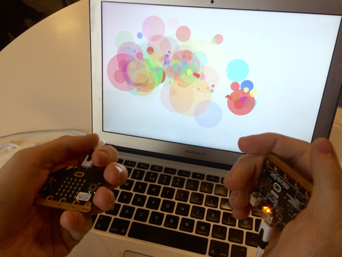

# Microbit Paint Thrower

My contribution to the [micro:bit.party](https://www.microbitparty.net), a hackathon for creating fun projects that kids can learn BBC micro:bit on.

The project consists of two micro-bits connected to a comuter with a Processing sketch showing the wall with “paint” thrown on it.

Assignment text is in Norwegian. Both the prose and code bears the signs of being hastily written.

